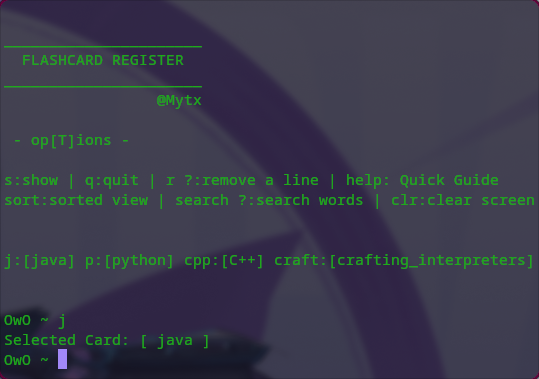
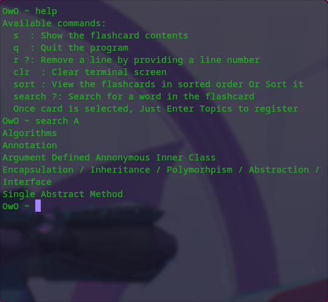

📚 Flashcard Register

A light-weight terminal-based tool to quickly register, remove, sort, and search your flashcard topics.
Built to make learning (and forgetting less) a little bit easier.

DEMO

Like everyone else, I tend to forget what I read if I don't use it often.
Traditional note-taking didn't work for me because I rarely reviewed my notes.

Instead, I started recording topics into simple text files — later feeding them to AI to quiz me or summarize the material.
Manually opening editors every 20 minutes just got annoying.

This tiny tool was my solution.
It's small, simple — but it fits right into my workflow and actually helps me stay consistent.

Built with a bit of boredom, a lot of curiosity, and no unnecessary overhead.
Plus Scripting is super fun xD.

Made by @Mytx.

✨ Features
* Add new topics to a card

* Remove a topic by line number

* Search for keywords

* View or permanently sort entries alphabetically

* Lightweight and fast (no dependencies except bash and optionally bat)

  📦 Installation
Just clone the repo and run:

bash flashcard_register.sh

Note: You need to set your flashcards directory in the script ($dir variable).
      Edit your file names in cards array & key map in keys array.

Optional: Install bat for better text file viewing.
Otherwise, fallback to cat inside the script.

🛠️ Usage
Select a card (e.g., Java, Python, etc.)

Enter a new topic by just typing it

Use commands like:

s → Show all topics

r [line_number] → Remove a topic

sort → View sorted version, or apply sorting

search [word] → Search for a word

q → Quit

help → Quick peek for commands
